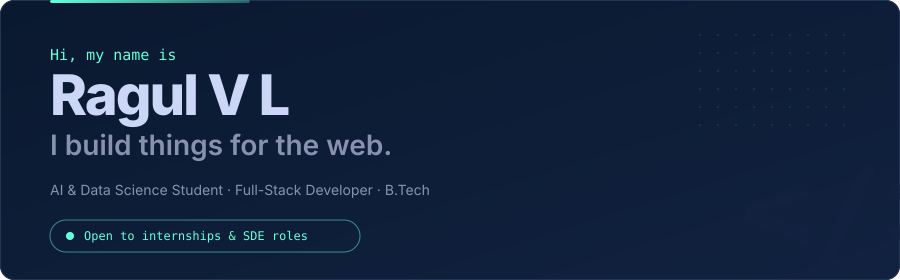
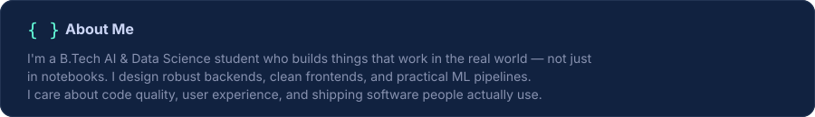
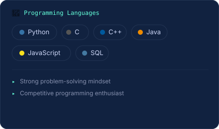
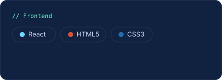
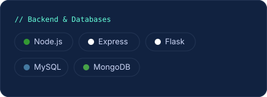
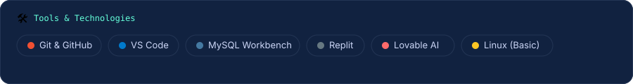
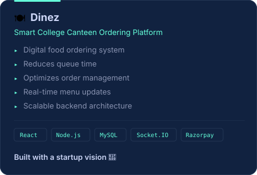
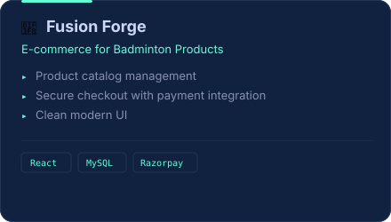
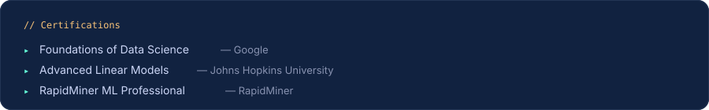
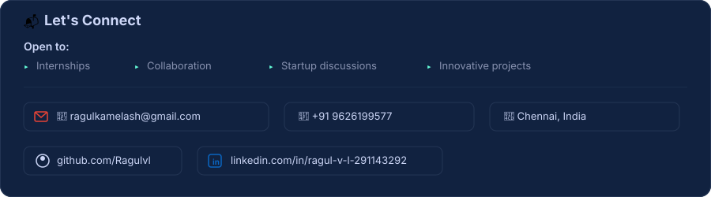

  

 

  

 
  
<!-- Tech Stack — Bento Grid -->
<table>
  <tr>
    <td width="50%">
      
    </td>
    <td width="50%">
      
    </td>
  </tr>
  <tr>
    <td colspan="2">
      
    </td>
  </tr>
</table>

  

 

<!-- Projects — Side by Side -->
<table>
  <tr>
    <td width="50%">
      
    </td>
    <td width="50%">
      
    </td>
  </tr>
</table>

 

  

 

  

 

  

