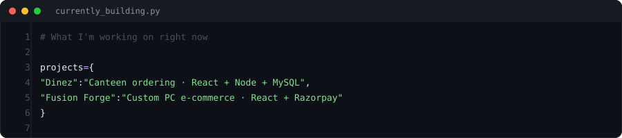

  

 

  

## ⚡ About

I'm a B.Tech AI & Data Science student who builds things that work in the real world — not just in notebooks. I design robust backends, clean frontends, and practical ML pipelines. I care about code quality, user experience, and shipping software that people actually use.

  

## 🛠️ Tech Stack

**Languages**

**Frontend**

**Backend & Databases**

**ML & Data**

**Tools**

  

## 🚀 Currently Building

  

<table>
  <tr>
    <td width="50%">
      <h3>🍽️ Dinez</h3>
      
Full-stack canteen ordering platform — built for real college use with real-time order tracking.

      

        
        
        
        
        
      

    </td>
    <td width="50%">
      <h3>🖥️ Fusion Forge</h3>
      
E-commerce platform for custom PC builds with integrated payment processing.

      

        
        
        
      

    </td>
  </tr>
</table>

  

## 📊 GitHub Stats

  
  &nbsp;&nbsp;
  

  

  

## 🏅 Certifications

| Certification | Issuer |
|---|---|
| Foundations of Data Science | **Google** |
| Advanced Linear Models | **Johns Hopkins University** |
| RapidMiner ML Professional | **RapidMiner** |

  

## 🤝 Connect

  &nbsp;&nbsp;
  &nbsp;&nbsp;
  

 

  

