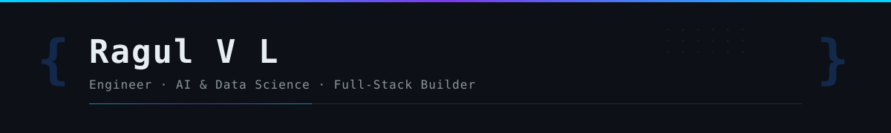

<p align="center">
  
</p>

<p align="center">
  
</p>

---

```yaml
name: Ragul V L
role: AI & Data Science Student · Aspiring SDE
location: India
focus:
  - Production-ready web applications
  - Practical ML systems & data pipelines
  - Clean architecture & scalable backends
currently_building:
  - Dinez — college canteen ordering platform (web + mobile)
  - Fusion Forge — custom PC e-commerce (React + MySQL + Razorpay)
education: B.Tech in AI & Data Science
open_to: Internships & SDE opportunities
```

---

## ⚙️ Tech Stack

<p align="center">
  <a href="https://skillicons.dev">
    
  </a>
</p>

---

## 📊 GitHub Stats

<div align="center">

<picture>
  <source media="(prefers-color-scheme: dark)" srcset="https://github-readme-stats.vercel.app/api?username=Ragulvl&show_icons=true&theme=github_dark&hide_border=true&bg_color=0d1117&title_color=58a6ff&icon_color=1f6feb&text_color=c9d1d9&include_all_commits=true&count_private=true" />
  <source media="(prefers-color-scheme: light)" srcset="https://github-readme-stats.vercel.app/api?username=Ragulvl&show_icons=true&theme=default&hide_border=true&include_all_commits=true&count_private=true" />
  
</picture>
&nbsp;
<picture>
  <source media="(prefers-color-scheme: dark)" srcset="https://streak-stats.demolab.com?user=Ragulvl&theme=github-dark-blue&hide_border=true&background=0d1117&ring=58a6ff&fire=58a6ff&currStreakLabel=58a6ff" />
  <source media="(prefers-color-scheme: light)" srcset="https://streak-stats.demolab.com?user=Ragulvl&theme=default&hide_border=true" />
  
</picture>

<br/>

<picture>
  <source media="(prefers-color-scheme: dark)" srcset="https://github-readme-stats.vercel.app/api/top-langs/?username=Ragulvl&layout=compact&theme=github_dark&hide_border=true&bg_color=0d1117&title_color=58a6ff&text_color=c9d1d9&langs_count=8" />
  <source media="(prefers-color-scheme: light)" srcset="https://github-readme-stats.vercel.app/api/top-langs/?username=Ragulvl&layout=compact&theme=default&hide_border=true&langs_count=8" />
  
</picture>

</div>

---

## 📈 Contribution Graph

<picture>
  <source media="(prefers-color-scheme: dark)" srcset="https://github-readme-activity-graph.vercel.app/graph?username=Ragulvl&theme=github-dark&hide_border=true&bg_color=0d1117&color=c9d1d9&line=58a6ff&point=1f6feb&area=true&area_color=1f6feb" />
  <source media="(prefers-color-scheme: light)" srcset="https://github-readme-activity-graph.vercel.app/graph?username=Ragulvl&theme=github-light&hide_border=true&area=true" />
  
</picture>

<br/>

<picture>
  <source media="(prefers-color-scheme: dark)" srcset="https://raw.githubusercontent.com/Ragulvl/ragulvl/output/github-snake-dark.svg" />
  <source media="(prefers-color-scheme: light)" srcset="https://raw.githubusercontent.com/Ragulvl/ragulvl/output/github-snake.svg" />
  
</picture>

---

## 🚀 Featured Projects

<div align="center">

<a href="https://github.com/Ragulvl/fusion-forge">
  <picture>
    <source media="(prefers-color-scheme: dark)" srcset="https://github-readme-stats.vercel.app/api/pin/?username=Ragulvl&repo=fusion-forge&theme=github_dark&hide_border=true&bg_color=0d1117&title_color=58a6ff&icon_color=1f6feb&text_color=c9d1d9" />
    <source media="(prefers-color-scheme: light)" srcset="https://github-readme-stats.vercel.app/api/pin/?username=Ragulvl&repo=fusion-forge&theme=default&hide_border=true" />
    
  </picture>
</a>
&nbsp;
<a href="https://github.com/Ragulvl/dinez">
  <picture>
    <source media="(prefers-color-scheme: dark)" srcset="https://github-readme-stats.vercel.app/api/pin/?username=Ragulvl&repo=dinez&theme=github_dark&hide_border=true&bg_color=0d1117&title_color=58a6ff&icon_color=1f6feb&text_color=c9d1d9" />
    <source media="(prefers-color-scheme: light)" srcset="https://github-readme-stats.vercel.app/api/pin/?username=Ragulvl&repo=dinez&theme=default&hide_border=true" />
    
  </picture>
</a>

</div>

---

## 🏅 Certifications

- **Foundations of Data Science** — Google
- **Advanced Linear Models** — Johns Hopkins University
- **RapidMiner Machine Learning Professional**

---

## 🤝 Connect

<p align="center">
  <a href="https://github.com/Ragulvl"></a>&nbsp;
  <a href="https://www.linkedin.com/in/ragul-v-l-291143292/"></a>&nbsp;
  <a href="mailto:ragulkamelash@gmail.com"></a>
</p>

<p align="center"><strong>Open to internships & SDE opportunities — let's connect.</strong></p>

<p align="center">
  
</p>
