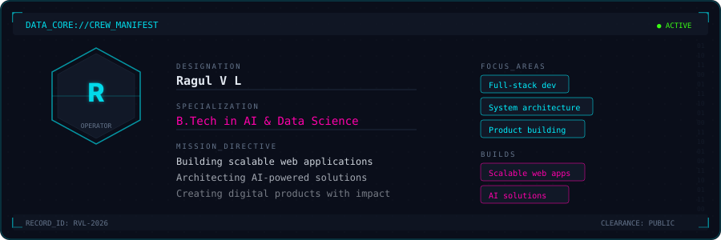
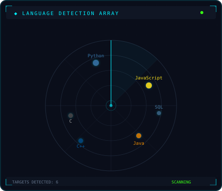
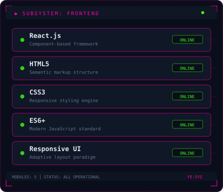
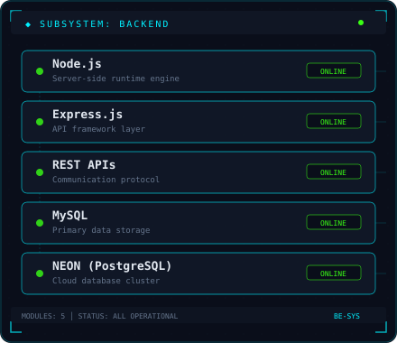
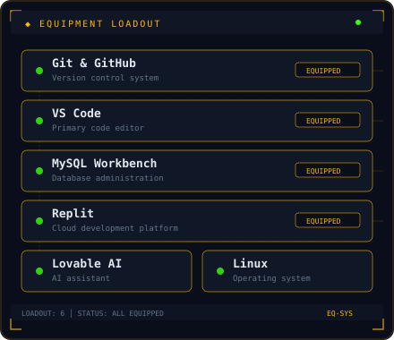
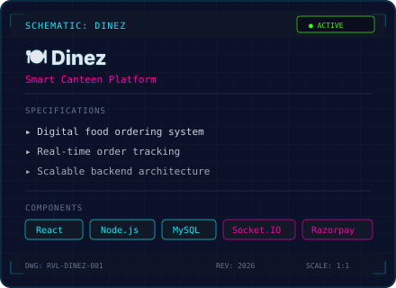
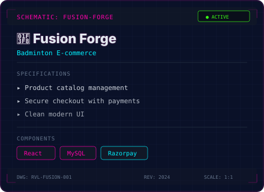
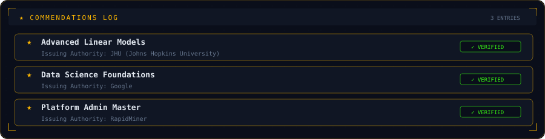
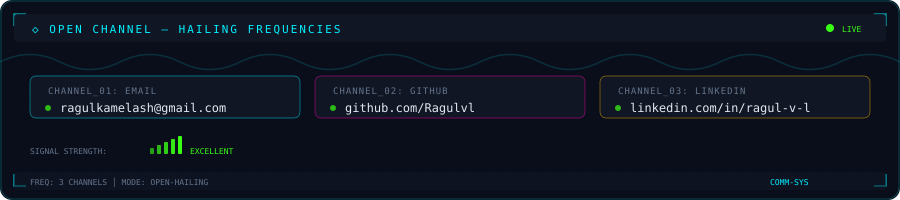

  

 

  

 

<!-- Skills — HUD Panels + Radar -->
<table>
  <tr>
    <td width="50%">
      
    </td>
    <td width="50%">
      
    </td>
  </tr>
  <tr>
    <td width="50%">
      
    </td>
    <td width="50%">
      
    </td>
  </tr>
</table>

 

<!-- Projects — Blueprints -->

|  |  |
|:---:|:---:|

 

  

 

  

 

  

