

  

 

  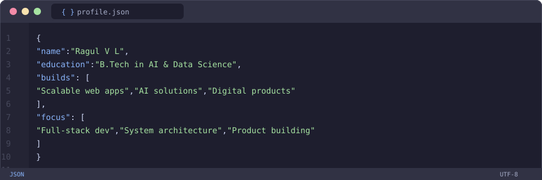

 

<!-- Skills — Bento Grid -->
<table>
  <tr>
    <td width="50%">
      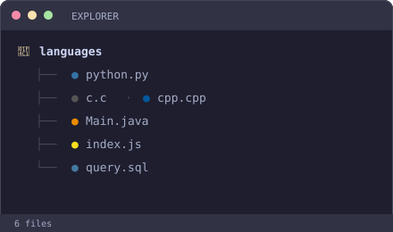
    </td>
    <td width="50%">
      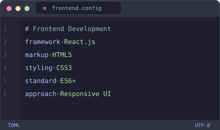
    </td>
  </tr>
  <tr>
    <td width="50%">
      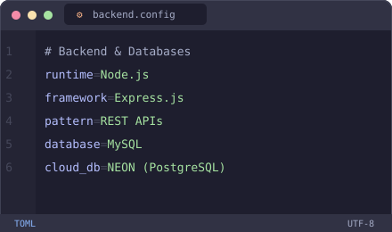
    </td>
    <td width="50%">
      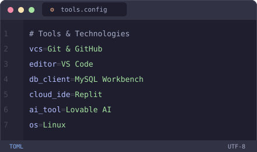
    </td>
  </tr>
</table>

 

<!-- Projects — Git Commits -->
<table>
  <tr>
    <td width="50%">
      <a href="https://github.com/Ragulvl/dinez">
        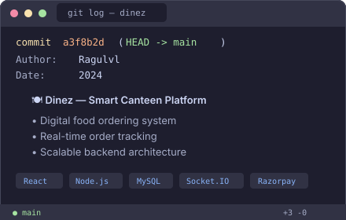
      </a>
    </td>
    <td width="50%">
      <a href="https://github.com/Ragulvl/fusion-forge">
        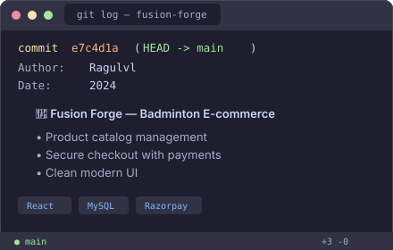
      </a>
    </td>
  </tr>
</table>

 

  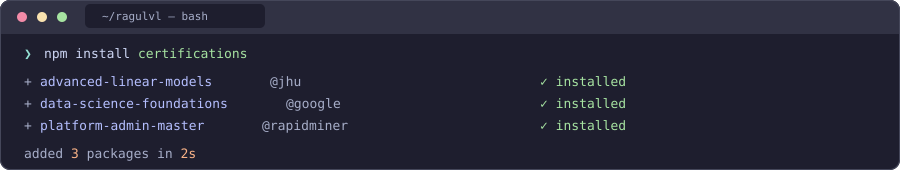

 

  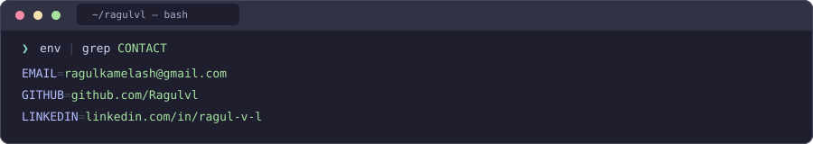

 

  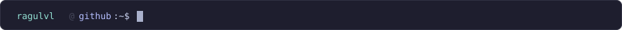

