# Ragul V L

  

  

  

---

## About
AI & Data Science student and aspiring SDE focused on building production-ready web apps and practical ML systems. I combine robust backend design, clean frontend, and reliable ML pipelines.

---

## Tech Stack

   &nbsp;
  <strong>Languages:</strong> Python · C++ · Java · JavaScript · SQL 
  <strong>Frontend:</strong> React · HTML · CSS 
  <strong>Backend / DB:</strong> Flask / Node · MySQL · REST APIs 
  <strong>ML / Data:</strong> scikit-learn · pandas · NumPy

---

## Selected Projects
- **Fusion Forge** — Full-stack e-commerce for custom PC builds (React + MySQL + Razorpay).  
  Repo: [fusion-forge](https://github.com/Ragulvl/fusion-forge)

- **Dinez** — College canteen ordering app — web + mobile in development.  
  Repo: [dinez](https://github.com/Ragulvl/dinez)

---

## CI / Workflow & Activity

  

I use GitHub Actions for automation, continuous integration, and content updates (README rotation & status).

---

## Certifications
- Foundations of Data Science — Google  
- Advanced Linear Models — Johns Hopkins University  
- RapidMiner Machine Learning Professional

---

## Contact
- GitHub: [Ragulvl](https://github.com/Ragulvl)  
- LinkedIn: [ragul-v-l](https://www.linkedin.com/in/ragul-v-l-291143292/)  
- Email: ragulkamelash@gmail.com

**Open to internships & SDE opportunities — feel free to reach out.**
