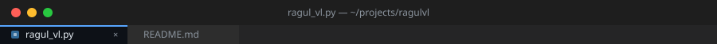
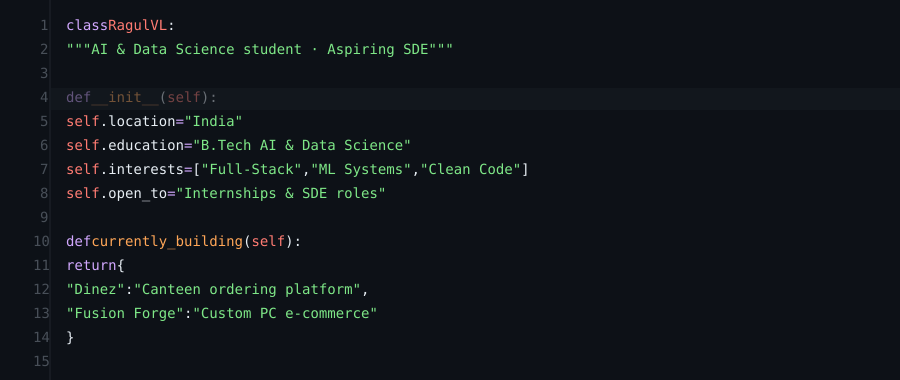
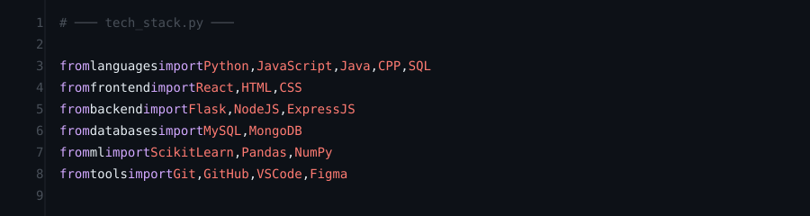
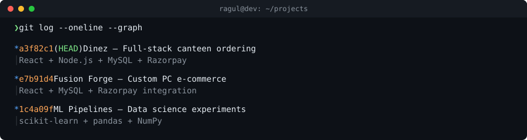
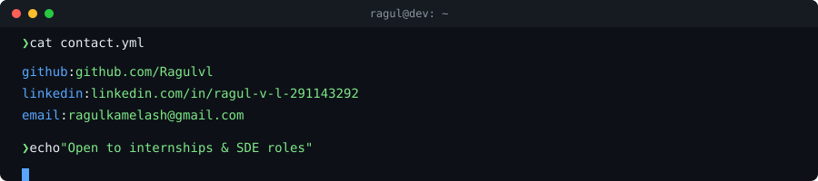

<p align="center">
  
</p>

<p align="center">
  
</p>

<p align="center">
  
</p>

<p align="center">
  
</p>

<p align="center">
  
</p>

<p align="center">
  
</p>

---

### Certifications

```
 ✦  Foundations of Data Science          — Google
 ✦  Advanced Linear Models              — Johns Hopkins University
 ✦  RapidMiner ML Professional          — RapidMiner
```

<p align="center">
  
</p>

<p align="center">
  
</p>
